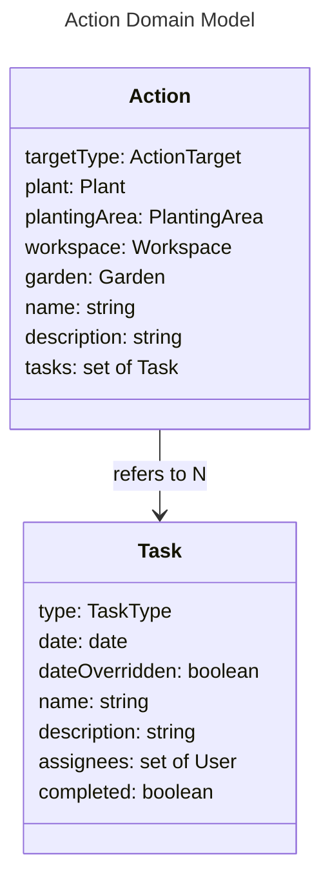

# Actions - Models

# Action

An Action represents a task or set of tasks which needs to be completed to bring the real world in line with the model. Actions will be automatically maintained by the software. For example, when adding a Plant, a number of Actions will be added correlating to the tasks which need to be done for this plant. If the plant is modified, these updates will be propogated to its related Actions. Actions may also be created manually.

## targetType, plant, plantingArea, workspace, garden

An Action may be tied to another entity. The options are:

- Plant
- PlantingArea
- Workspace
- Garden
- Other

If `targetType` is `other` or `garden`, the `plant`, `plantingArea`, and `workspace`, attributes will be undefined. Otherwise, they will be defined based on the value of `targetType`.

## tasks

An Action is made up of multiple Tasks, which each describe an individual task. For example, a Plant might have one Action which contains Tasks for planting it, transplanting it, harvesting it, etc.

An Action has no `completed` or `assignees` of its own: it's considered complete when every one of its Tasks is, and its assignees are the union of its Tasks' assignees. Assignment and completion are always decided at the Task level, since that's the actual unit of work someone picks up.

# Task

## type

Each Task has a type. These types are what the software uses to automatically populate task descriptions for each plant. The type options are:

- Seed a plant
- Germinate a plant
- Thin around a plant
- Harden a plant
- Transplant a plant
- Harvest a plant
- Expire a plant
- Prune a plant
- Cover a planting area
- Weed a planting area
- Till a planting area
- Tidy a workspace
- Apply fertilizer
- Irrigate
- Other

## assignees

The Users responsible for completing this Task. A Task may be assigned by another User, or self-claimed by any User when it has none.

## date and dateOverridden

`date` is normally computed automatically from its Plant's `expectedLifespan` and Cultivar timing, and is kept in sync as those change, same as the rest of an Action. If a User manually reschedules a Task, `dateOverridden` is set to true and `date` stops being recomputed automatically, so the software doesn't silently move a Task someone has deliberately pinned to a day.

## completed

Seed, Germinate, Transplant, Harvest, and Expire each have a matching type in [Observe](../planner/wireframes.md#observe). For these, `completed` can be set two ways, and both keep the underlying Plant in sync:

- Directly, which writes a minimal observation onto the Task's Plant using today's date and no further detail - the same effect as recording one through Observe, just with defaults instead of a filled-in form.
- By recording a full observation of the matching type through Observe, which completes the open Task on the Plant automatically.

Every other type (Thin, Harden, Prune, Cover a planting area, Weed a planting area, Till a planting area, Tidy a workspace, Apply fertilizer, Apply water, Custom) has no matching observation type, since there's no Plant data to write - `completed` is a plain manual toggle for these.
