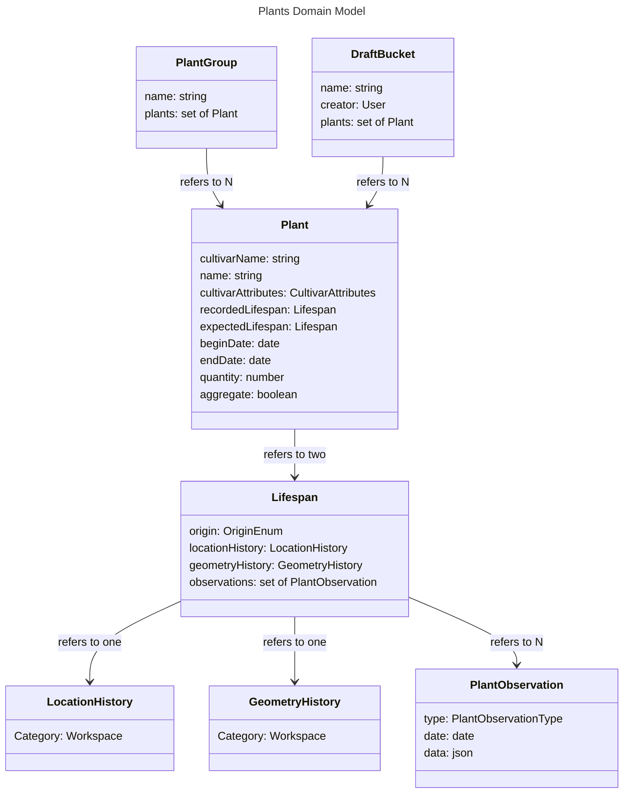

# Plants - Models

# Lifespan

The lifespan stores all data about a plant which may differ from expected to real behaviour.

## origin

The origin stores how the plant was created. Options are:

- directSeed: A seed is sown directly into the area it will reach maturity in.
- seedToTransplant: A seed is sown in one area and then transplanted into the area it will reach maturity in.
- seedlingToTransplant: A seedling is transplanted directly into the area it will reach maturity in.

In direct seed mode, most plants will have one location: the one they were seeded in. In seed to transplant mode, a plant will have at least two locations: the one where it was seeded, usually in a dedicated seed starting area, and where it is transplanted. Both should be defined when the plant is created. In the seedling to transplant mode, the plant starts as a seedling, for example, when seedlings are sourced from a nursery.

## locationHistory and geometryHistory

Both location and geometry may vary over time, as plants move around or grow.

## observations

Every dated event in a Plant's life - seeding, germination, flowering, entering or exiting dormancy, expiry, and harvests - is a generic `PlantObservation` record (`type`, `date`, optional `data`), not a dedicated scalar field. There's no limit on how many of a given type a Lifespan can hold. `type` is one of:

- `plant-seed`: the date the plant was sown as a seed.
- `plant-germ`: the date the seed germinated.
- `plant-flower`: a date the plant flowered or fruited. Not every Plant gets one - cultivars typically harvested before this would occur (most root and leaf crops) simply never have one.
- `plant-harvest`: a harvest from the plant. `data` holds `mass` (kg) and `quality`, plus an optional `description`. `quality` is a free-text string, not a closed enum - defective/passable/average/exceptional are offered as suggested values during entry, not enforced, so a free-text description still fits when none of them apply.
- `plant-dormancy-enter` / `plant-growth-enter`: entering and exiting dormancy. Only meaningful for biennials/perennials.
- `plant-expiry`: the date the plant was removed from the space.

Because there's no cardinality limit, a long-lived perennial's repeating flower/fruit/dormancy years are just more observations of the same type, one per cycle - not a set-typed field needing its own cycle-tracking logic. [GrowthStage](#growthstage) below reads whichever observations actually exist near the focused day, rather than assuming a fixed number of them.

`data.units` - a count whose meaning depends on the plant (roots for carrots, heads for lettuce) - is a planned addition to `plant-harvest` alongside `mass`/`quality`, not yet implemented.

# GrowthStage

Not a stored field: a Plant's growth stage is computed from whichever Lifespan is active for a given day (recorded if present, otherwise expected - see the [Planner wireframes](../planner/wireframes.md#layout)), by finding the most recent relevant `observations` entries on or before that day. It's what selects an icon pack's SVG variant in the Layout. The stages, bounded by observation types, are:

- **seed**: `plant-seed` to `plant-germ`. Occurs once, ever.
- **vegetative**: the most recent `plant-germ` or `plant-growth-enter` on or before the focused day, up to the next `plant-flower` (if any) or the first-harvest milestone.
- **producing**: that `plant-flower`, or the first-harvest milestone if there's no `plant-flower` (cultivars with no `germToFlowering` set never get one), up to either `plant-expiry` or the next `plant-dormancy-enter`, whichever comes first. Covers flowering, fruiting, and harvesting as one stage rather than three - collapsed deliberately, since for most fruiting crops (tomatoes, beans, squash) flowering continues throughout the whole harvest window rather than ending when picking starts, so treating "flowering-or-fruiting" and "harvesting" as sequential, mutually exclusive stages was wrong for the common case. A Cultivar's `ExpectedGeometryProfile` still sizes flowering/firstHarvest/lastHarvest as distinct milestones within this one stage (see below) - the icon just doesn't need a variant for each of them the way geometry needs a size for each.
- **dormant**: biennial/perennial plants only, from a `plant-dormancy-enter` to the next `plant-growth-enter`.
- **expired**: after `plant-expiry`.

A plant that flowers and fruits every year doesn't re-germinate each year - it exits dormancy (`plant-growth-enter`) and repeats vegetative → producing before going dormant again. Because `observations` has no cardinality limit (see [Lifespan](#observations)), this falls out without any special handling: a long-lived perennial simply accumulates one `plant-flower` and one `plant-dormancy-enter`/`plant-growth-enter` pair per year, and stage computation just reads whichever ones are nearest the focused day. The sequence for such a plant is `seed` once, then `[vegetative → producing → dormant]` repeating once per year, ending in `expired` only when the Plant is actually removed.

## Relationship to origin

A Plant whose `origin` is `seedToTransplant` or `seedlingToTransplant` may have no `plant-seed`/`plant-germ` observation of its own - that happened before this Plant's own history began (e.g. at a nursery). Stage computation degrades gracefully for these: it starts at whichever stage the earliest observation actually present implies, rather than assuming every earlier stage happened on this Plant's own timeline.

## Relationship to transplanting

Transplanting is deliberately not a growth stage. It's a location/geometry event - recorded via Observe's Transplant type and tracked entirely through `locationHistory`/`geometryHistory` - not a change in the plant's biological appearance. A transplant doesn't advance or reset GrowthStage on its own.

## Relationship to Cultivar's ExpectedGeometryProfile

A Cultivar's `ExpectedGeometryProfile` (see [Cultivars models](../cultivars/models.md#expected-geometry)) scales geometry at seedling, flowering, firstHarvest, lastHarvest, expiry, enterDormancy, and exitDormancy - used to generate a Plant's default `expectedLifespan.geometryHistory` at creation. GrowthStage reads the same underlying observations but at coarser granularity, since `producing` deliberately covers flowering/firstHarvest/lastHarvest as one stage (see above): geometry still sizes each of those milestones distinctly, it's only the icon that doesn't switch variants between them. A milestone added to one isn't automatically owed to the other anymore - only `seed`/`vegetative`/`dormant`/`expired` still line up boundary-for-boundary with their geometry milestones.

# Plant

A plant represents a physical instance of a plant, or, if that level of granularity is not desired, a group of plants. The purpose of Plant models is:

1. To represent the spatial and temporal extent of plants during the planning phase, so that the can be planned around each other. For example, the more accurate of a model we have of how long a plant is going to last in a particular environment, the better we can plan to replace it with another, maximizing usage of space.
2. To represent the status of a plant in-real-life, for the purposes of tracking its progress, shifting the plan around this progress, and managing Actions associated with cultivating it.

## cultivarName

The plant model may store the name associated with a Cultivar, correlating with the `name` attribute in the Cultivar model. This is preferred to storing a direct reference to a Cultivar entity, as this allows flexibility in changing the CultivarCollection of a Garden without messing with the Plant model instances. When the attributes of a Cultivar are required, the name set on the Plant is used to search through the CultivarCollections set on the Garden.

## recordedLifespan and expectedLifespan

The purpose of storing two Lifespan objects is to clearly delineate between the attributes in the Plant model which have been planned with the software, and those which have been recorded from real life. When a Plant is created, its expectedLifespan is populated based on its Cultivar and any user-provided settings, while its recordedLifespan starts empty and is filled in incrementally as the user records what actually happens to the plant, for example that it has germinated or been harvested. Both are always present on the same Plant instance; there is no separate state or term for a Plant that only has expected data so far. How the two are told apart visually is described in the [Planner wireframes](../planner/wireframes.md#layout).

## cultivarAttributes

A set of [Cultivar attribute profiles](../cultivars/models.md) overriding the ones inherited from this Plant's resolved Cultivar - for a specific plant that, say, runs hotter or colder than its Cultivar's usual `TemperatureProfile`. Same shape as a Cultivar's own `profiles`, just scoped to one Plant instead of every Plant of that Cultivar.

## beginDate and endDate

A denormalized cache of the earliest and latest date across both Lifespans' observations, maintained alongside them rather than computed live. Exists purely so the rest of the app (e.g. which Plants fall within the Timeline Selector's range) doesn't need to query through both Lifespans' observations for every Plant just to bound it in time.

## quantity

The number of distinct real plants this one Plant instance represents. For a typical, non-aggregate Plant this is 1; for an `aggregate` Plant it's the count shown on its Layout icon (see [Planner wireframes](../planner/wireframes.md#aggregate-plants)).

## aggregate

If true, the model represents several different plants in real life. In this mode, less attention is paid to, for example, how geometry changes over time as plants grow, because the same model represents multiple plants. Instead of tracking individual carrots, we can use one model instance to track a square foot of space which has carrots in it, all planted at the same time.

# PlantGroup

PlantGroups are simple collections of references to Plants which serve to group them together for organizational purposes, e.g. tagging every Plant that belongs to a particular bed, or a particular season. A Plant may belong to any number of PlantGroups.

# DraftBucket

A DraftBucket groups the Plants that make up one unconfirmed plan, so several such plans can be built and compared before any of them are decided on. This is the persisted form of the Add Plants tool's "To Create" bucket described in the [Planner wireframes](../planner/wireframes.md#add-plants): a Plant belongs to at most one DraftBucket, and while it does, it's excluded from official reads of the garden's Plants (Action generation, yield totals, and similar), even though it's an ordinary Plant row and renders in the Layout, Tree, and Calendar like any other. Discarding a plan is an ordinary deletion of every Plant in its DraftBucket; accepting one is just deleting the DraftBucket itself, leaving its Plants in place as ordinary, non-draft Plants.

## creator

The User who started the plan. Since a DraftBucket's Plants are visible to other users of the Garden as an optional overlay rather than official state, `creator` is what lets the UI label whose plan is whose when more than one is visible at once.
