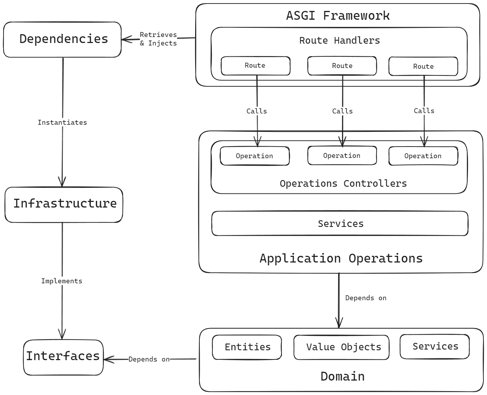

# Architecture and Design

The architecture of the backend is largely taken from the [Cosmic Python](https://github.com/cosmicpython/book) book, which is all about architecture patterns for managing complexity. The goal of the architecture is to have the core domain/business logic of the application be independent from all other implementation concerns and expressed as simply and transparently as possible. In theory, this minimizes the impedance between the semantics of the problem domain and the software, making it easier for the software to adapt to evolving ideas.

This pattern comes with the benefit of maintaining simple principles even as the software grows in complexity, such that features can continually be added and maintained without changing the overall structure. It comes at the cost of a higher complexity of design and repeated information, such as the need for seperate domain, persistence, and presentation models.

## Domain

The domain layer seeks to get as close as possible to the semantics of the domain as mapped and communicated by those with domain knowledge. To support this, it categorizes the logical modelling into *Entities*, *Value Objects*, *Aggregate Root Entities*, *Commands*, and *Events*.

The first three, *Entities*, *Value Objects*, *Aggregate Root Entities* are considered "models" as they represent a container for data and behaviour. The methods on these models are the core of the domain logic. Models are implemented using attrs.

*Commands*, and *Events* represent messages the system can respond to. 

### Entities

Entities are objects that are characterized by static unique identifiers rather than state. Identifiers are represented by UUIDs. Two entities are equivalent if their IDs are equal.

Entities can be persisted. The ID field is not generated until the first persistence, making it necessary to validate that entities are persisted during operations where this may not be the case.

Examples: Users, Gardens, Plants, etc.

### Value Objects

Value objects are objects that are characterize only by their state. Two value objects are equal if their values are equal. Value objects are immutable.

A value object that is not a member of an entity, by definition, is transient and cannot be persisted.

Examples: Emails, GardenMemberships, PlantingWindows, etc.

### Root Entities

Root entities are entities which define a transactional boundary with the database. This means that all domain logic is held self-consistent within aggregate roots. 

This is enforced by the convention of having one repository per root entity.

### Commands

Commands are inputs to the system which prompt it to change. 

They are implemented with Pydantic models which are used for the ease of implementing validation logic. Another benefit is that validation logic can be defined within the domain layer but the validation takes place at the edge of the system, when the ASGI process instantiated the object.

### Events

Events are internal messages that communicate that something has happened.

They are implemented with attrs.

## Application Operations (Ops)

The operations layer serves to orchestrate the domain layer, connect it with services, and provide an interface for the entrypoint layer to call, known as the MessageProcessor.

The operation handlers can be thought of as "use-cases" or individual workflows relevant to consumers of the app.

A typical ops workflow involves:

1. Locate all services, including a UnitOfWork.
2. Open the UnitOfWork context manager.
3. Validate any command against the UnitOfWork.
4. Fetch all required Root Entities.
5. Orchestrate the domain logic.
6. Commit the UnitOfWork.
7. Add any events.

When the calling process handles an incoming command, the command is executed and all events which occurred are either appended to the MessageProcessor's queue and executed as well, or they are sent to another process with an AbstractEventNode. This occurs until all events in the queue are complete.

### Commands

The commands section of the ops layer holds command handlers, which take a Command object, a service locator container, and an optional client user.

Command handlers do not return anything.

### Events

The events section of the ops layer holds event handlers, which take an Event object and a service locator container.

Event handlers do not return anything.

### Queries

The queries section of the ops layer holds Queries, QueryResults, and query handlers.

Queries are implemented with Pydantic models, similar to the Command objects in the domain.

QueryResults are implemented with attrs and cattrs. Cattrs generates mapping code between the domain model attrs classes and the QueryResult classes, enabling seamless casting. QueryResults may have a subset of the attributes of their associated domain model, and the type of sub-models in the QueryResult can be other QueryResults without problem.

Query handlers take a Query object, a service locator container, and an optional client user, and return a QueryResult.

## Interfaces

In order to avoid the domain and operations layer being dependent on implementation details, any services they need to be interacted with are put behind abstract interfaces. This inverts the dependency of the domain on the services by making both the domain and service dependent on the interface.

The advantage of this is decoupling between layers of the application. Changing the database involves writing new adapters for the interfaces, but the changes are limited to the adapters, because the interface remains the same. An example of the usefulness of this property will be seen in the future when a cache system for differential synchronization will be implemented - as persisting domain objects to a cache vs. a database will be able to be abstracted through the same interface.

Generally, anything that involves a stateful dependency, such as SqlAlchemy code that maintains a connection to a database, and anything that will likely need to be switched out at some point, is worth putting behind an interface. Libraries which provide stateless utilities do not need to be abstracted in this way.

Interfaces are implemented using Python's Protocol type. Some examples of interfaces are:
1. A Repository class provides connectivity between the domain models and the database, including adding new entities to the database and retrieving entities.
2. The UnitOfWork interface contains all repositories required by the application and provides a context manager for managing database transactions.
3. The EventNode interface allows the application to push events to an event stream, so the ASGI process and task backend can communicate.

## Adapters

The adapters layer contains implementations of the interfaces.

Adapters are organized using the `svcs` library, which provides a service locator registry and container. All required adapters and their factory functions are added to the registry, and the entrypoints initialize a service container from that registry to pass into the operations layer, allowing the operations handlers to locate services as needed. 

## Entrypoints

The entrypoints layer contains the application process code including the ASGI application and the task backend, as both of these processes are the gateways through which the operations layer is connected to the network.

For the ASGI application, a general rule is that there is one route handler per command/query handler. There should be no business/application logic executed in the route handler - the function of the route handler is to call the operation handler. The utility of the route handler, in the case of the Litestar framework, is taking the Command, Query, and QueryResult objects defined in the domain and ops layers, and handling all network-related de/serialization, as well as generating an OpenAPI schema.

The task backend can receive tasks from the ASGI process, as well as schedule its own tasks using cron jobs. The main purpose of the task backend will be to implement special computation tasks such as differential synchronization for multi-client editing, simulated annealing for generation of planting arrangements, and interacting with external APIs. 