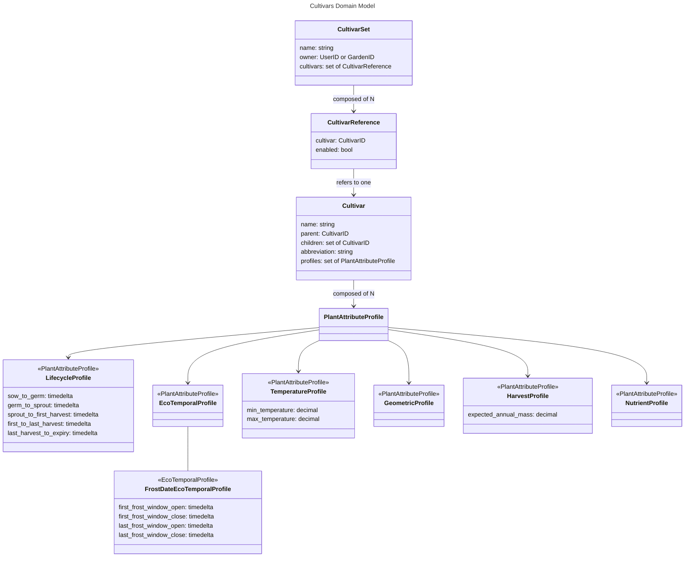

# Cultivars - Models

```mermaid
---
title: Cultivars Domain Model
---
classDiagram

    CultivarSet --> CultivarReference : composed of N
    CultivarReference --> Cultivar : refers to one
    Cultivar --> PlantAttributeProfile : composed of N
    PlantAttributeProfile --> LifecycleProfile
    PlantAttributeProfile --> EcoTemporalProfile
    EcoTemporalProfile -- FrostDateEcoTemporalProfile
    PlantAttributeProfile --> TemperatureProfile
    PlantAttributeProfile --> GeometricProfile
    PlantAttributeProfile --> HarvestProfile
    PlantAttributeProfile --> NutrientProfile

    class CultivarSet{
        name: string
        owner: UserID or GardenID
        cultivars: set of CultivarReference
    }
    class CultivarReference{
        cultivar: CultivarID
        enabled: bool
    }
    class Cultivar{
        name: string
        parent: CultivarID
        children: set of CultivarID
        abbreviation: string
        profiles: set of PlantAttributeProfile
    }
    class PlantAttributeProfile{

    }
    class LifecycleProfile{
        <<PlantAttributeProfile>>
        sow_to_germ: timedelta
        germ_to_sprout: timedelta
        sprout_to_first_harvest: timedelta
        first_to_last_harvest: timedelta
        last_harvest_to_expiry: timedelta
    }
    class EcoTemporalProfile{
        <<PlantAttributeProfile>>
    }
    class FrostDateEcoTemporalProfile{
        <<EcoTemporalProfile>>
        first_frost_window_open: timedelta
        first_frost_window_close: timedelta
        last_frost_window_open: timedelta
        last_frost_window_close: timedelta
    }
    class TemperatureProfile{
        <<PlantAttributeProfile>>
        min_temperature: decimal
        max_temperature: decimal
    }
    class GeometricProfile{
        <<PlantAttributeProfile>>
    }
    class HarvestProfile{
        <<PlantAttributeProfile>>
        expected_annual_mass: decimal

    }
    class NutrientProfile{
        <<PlantAttributeProfile>>

    }

```