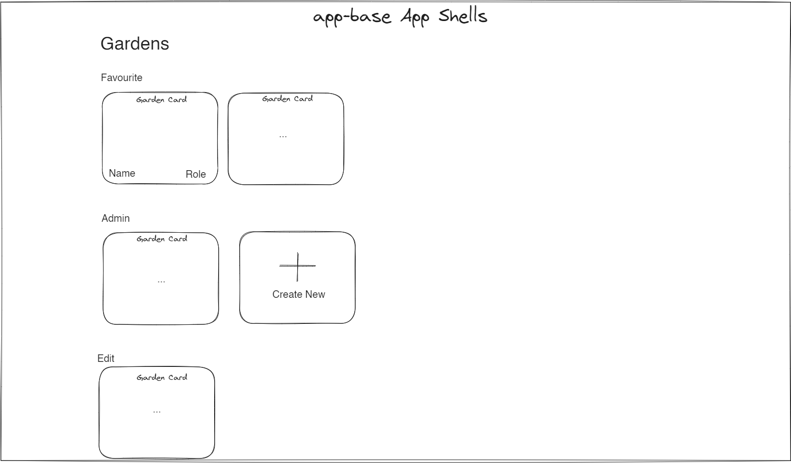
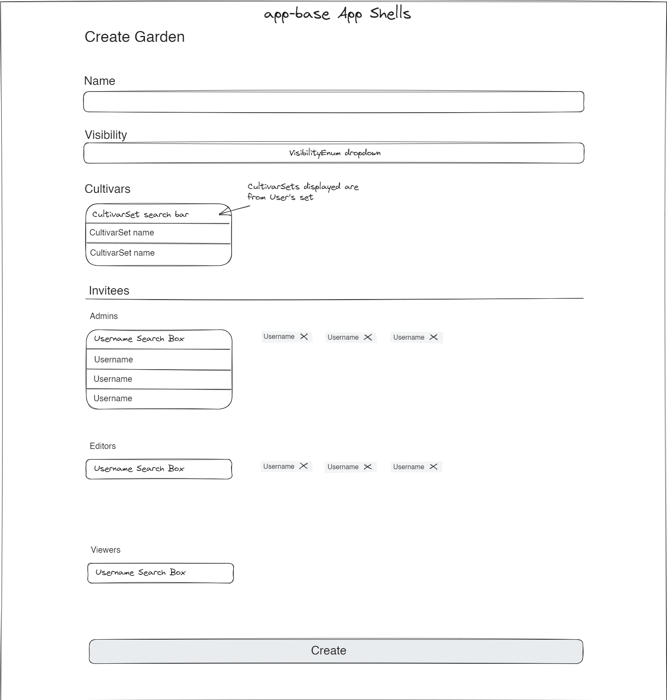
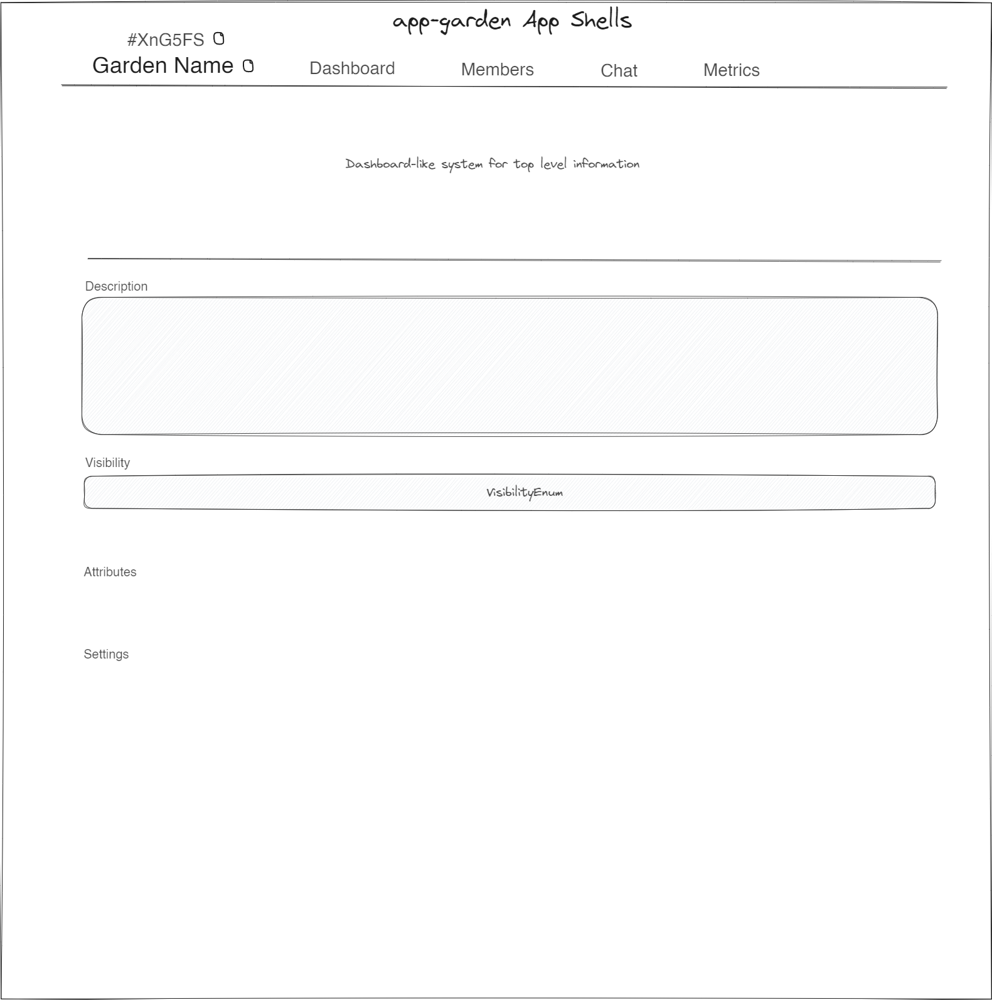
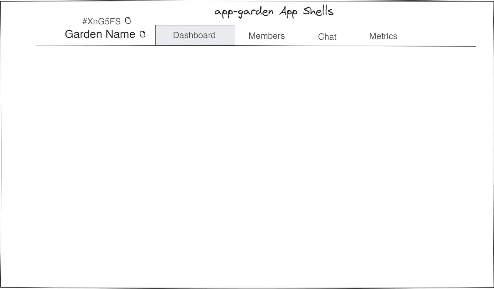
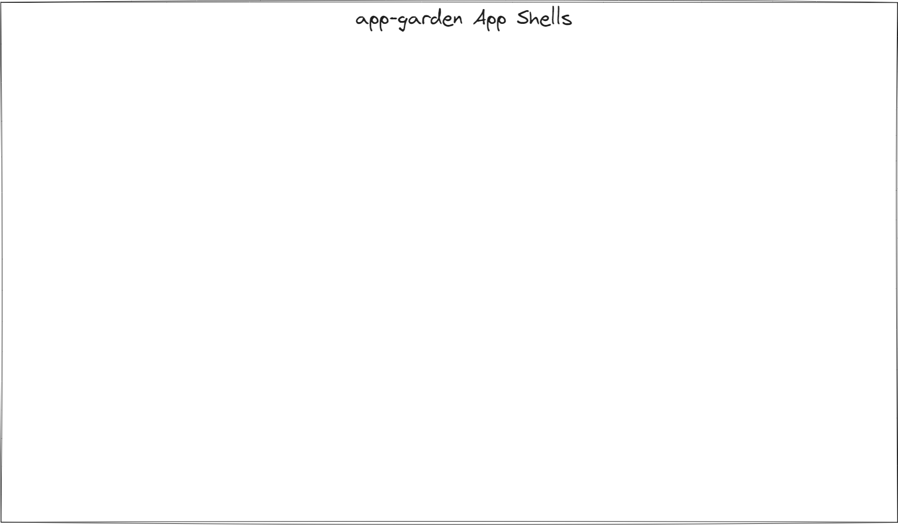

# Garden - Wireframes

The Garden wireframes allow:
- Viewing all the gardens a user has access to
- Viewing all the pending invites
- Creating a new garden
- Editing garden attributes
- Viewing the dashboard, members, chat, and metrics. 

# App Base Context

These frames exist outside of the context of a specific garden.

## Gardens

## Create

# App Garden Context

These frames exist outside of the context of a specific garden.

## Garden

Edit the Garden and its AttributeProfiles.

## Dashboard

## Members

## Metrics

## Chat

