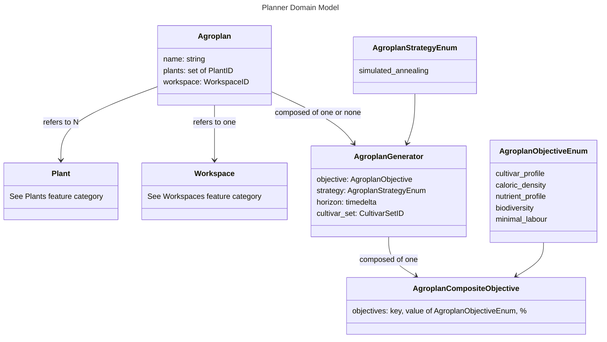

```mermaid
---
title: Planner Domain Model
---
classDiagram

    Agroplan --> Plant : refers to N
    Agroplan --> Workspace: refers to one
    Agroplan --> AgroplanGenerator : composed of one or none
    AgroplanStrategyEnum --> AgroplanGenerator
    AgroplanGenerator --> AgroplanCompositeObjective : composed of one
    AgroplanObjectiveEnum --> AgroplanCompositeObjective
    class Agroplan{
        name: string
        plants: set of PlantID
        workspace: WorkspaceID
    }
    class Plant{
        See Plants feature category
    }
    class Workspace{
        See Workspaces feature category
    }
    class AgroplanGenerator{
        objective: AgroplanObjective
        strategy: AgroplanStrategyEnum
        horizon: timedelta
        cultivar_set: CultivarSetID
    }
    class AgroplanStrategyEnum{
        simulated_annealing
    }
    class AgroplanCompositeObjective{
        objectives: key, value of AgroplanObjectiveEnum, %
    }
    class AgroplanObjectiveEnum{
        cultivar_profile
        caloric_density
        nutrient_profile
        biodiversity
        minimal_labour
    }

```