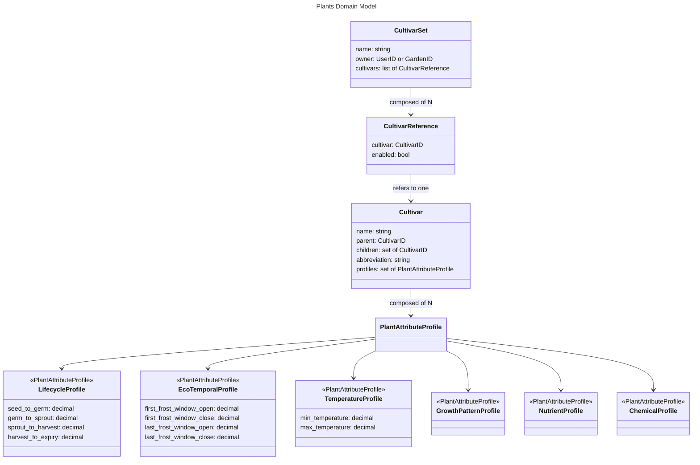

# Garden - Models

```mermaid
---
title: Plants Domain Model
---
classDiagram

    CultivarSet --> CultivarReference : composed of N
    CultivarReference --> Cultivar : refers to one
    Cultivar --> PlantAttributeProfile : composed of N
    PlantAttributeProfile --> LifecycleProfile
    PlantAttributeProfile --> EcoTemporalProfile
    PlantAttributeProfile --> TemperatureProfile
    PlantAttributeProfile --> GrowthPatternProfile
    PlantAttributeProfile --> NutrientProfile
    PlantAttributeProfile --> ChemicalProfile

    class CultivarSet{
        name: string
        owner: UserID or GardenID
        cultivars: list of CultivarReference
    }
    class CultivarReference{
        cultivar: CultivarID
        enabled: bool
    }
    class Cultivar{
        name: string
        parent: CultivarID
        children: set of CultivarID
        abbreviation: string
        profiles: set of PlantAttributeProfile
    }
    class PlantAttributeProfile{

    }
    class LifecycleProfile{
        <<PlantAttributeProfile>>
        seed_to_germ: decimal
        germ_to_sprout: decimal
        sprout_to_harvest: decimal
        harvest_to_expiry: decimal
    }
    class EcoTemporalProfile{
        <<PlantAttributeProfile>>
        first_frost_window_open: decimal
        first_frost_window_close: decimal
        last_frost_window_open: decimal
        last_frost_window_close: decimal

    }
    class TemperatureProfile{
        <<PlantAttributeProfile>>
        min_temperature: decimal
        max_temperature: decimal
    }
    class GrowthPatternProfile{
        <<PlantAttributeProfile>>
    }
    class NutrientProfile{
        <<PlantAttributeProfile>>

    }
    class ChemicalProfile{
        <<PlantAttributeProfile>>

    }

```
