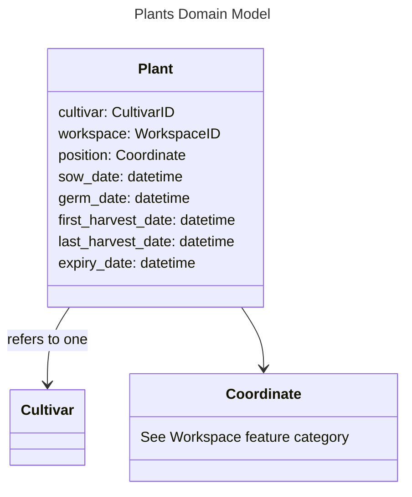

# Plants - Models

```mermaid
---
title: Plants Domain Model
---
classDiagram

    Plant --> Cultivar : refers to one
    Plant --> Coordinate

    class Plant{
        cultivar: CultivarID
        workspace: WorkspaceID
        position: Coordinate
        sow_date: datetime
        germ_date: datetime
        first_harvest_date: datetime
        last_harvest_date: datetime
        expiry_date: datetime
    }
    class Coordinate{
        See Workspace feature category
    }

```