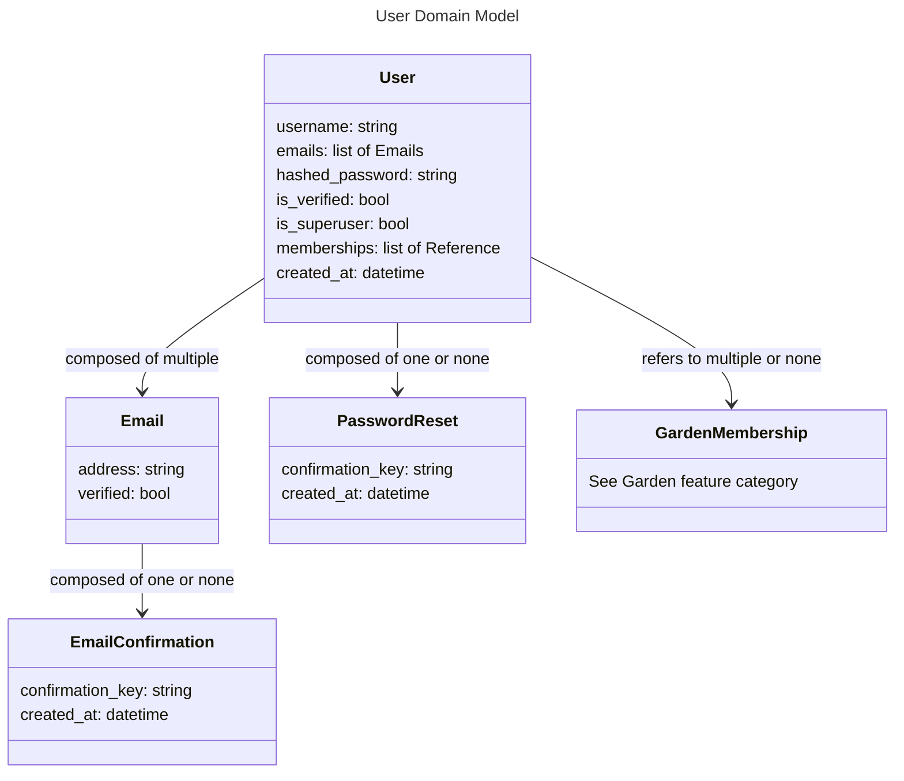

# User Models

# User

## username

The username should be the main identifier between users in the application. Usernames should be unique, case insensitive, and able to be changed at any time. Usernames should be validated to ensure no offensive or unsafe names are allowed.

## emails

A user should be able to have multiple emails, such that new emails can be added, old emails removed, and a primary email set. The primary email will be the one to receive communications from the application, and be used for password resets and user verification.

## is_superuser

Superusers should be given access to any admin interfaces. Superusers should only be able to be created through secure means that are not accessible to the main application, such as through custom database scripts.

## memberships

A user should be able to be a member of multiple gardens. Membership should be able to be managed by the user.