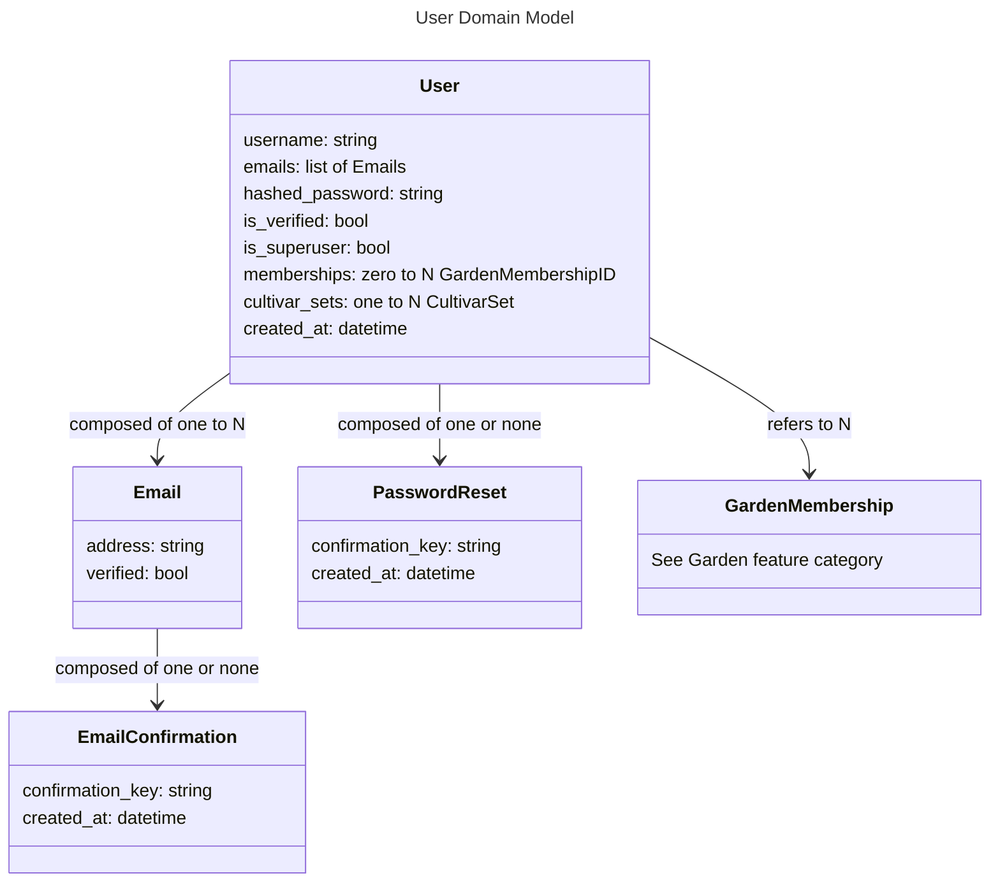

# User - Models

# User

## username

The username should be the main identifier between users in the application. Usernames should be unique, case insensitive, and able to be changed at any time. Usernames should be validated to ensure no offensive or unsafe names are allowed.

## emails

A user should be able to have multiple emails, such that new emails can be added, old emails removed, and a primary email set. The primary email will be the one to receive communications from the application, and be used for password resets and user verification. The application should support a setting wheryby email verification is required for various levels of permissions in gardens: 

- Option A: Email verification is required for any access to the app (as opposed to the static-pages).
- Option B: Email verification is required for anything more than view access to a garden. (Recommended)
- Option C: Email verification is not required for anything.

## hashed_password

The password must be encrypted. A password reset should be available through email verification. 

## is_superuser

Superusers should be given access to any admin interfaces. Superusers should only be able to be created through secure means that are not accessible to the main application, such as through custom database scripts.

## memberships

A user should be able to be a member of multiple gardens. Membership in ones own gardens and other gardens should be able to be managed by the user.

## cultivar_sets

A user should be able to create CultivarSets connected to their profile, and copy them to and from gardens.