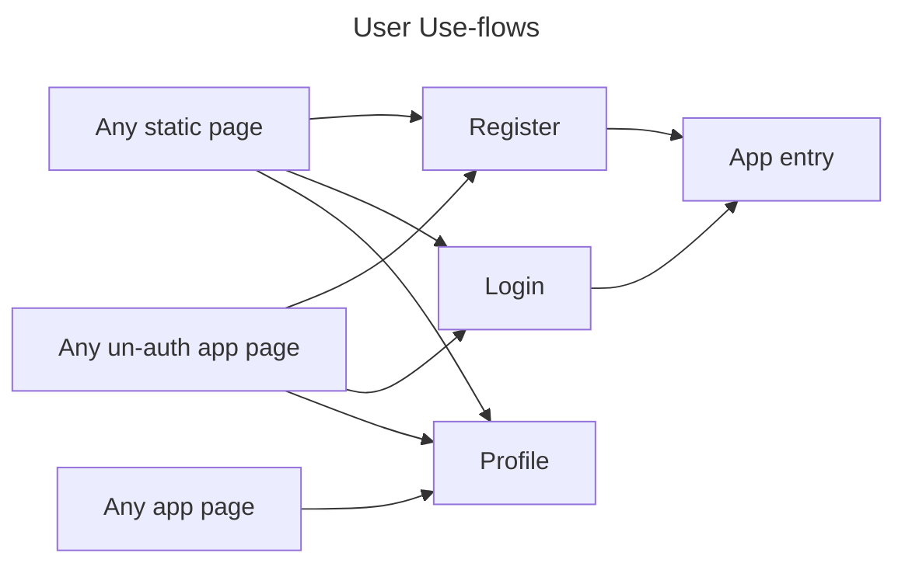

# User - Use-Flows

```mermaid
---
title: User Use-flows
---
flowchart LR

    static-page[Any static page]
    static-page-->register
    static-page-->login
    static-page-->profile

    app-page[Any app page]
    app-page-->profile

    unauth-app-page[Any un-auth app page]
    unauth-app-page-->register
    unauth-app-page-->login
    unauth-app-page-->profile
    
    app-entry[App entry]

    register[Register]
    register-->app-entry


    login[Login]
    login-->app-entry

    profile[Profile]

```

(From any static page) (through login button)-> Login

(From any static page) (through register button)-> Register