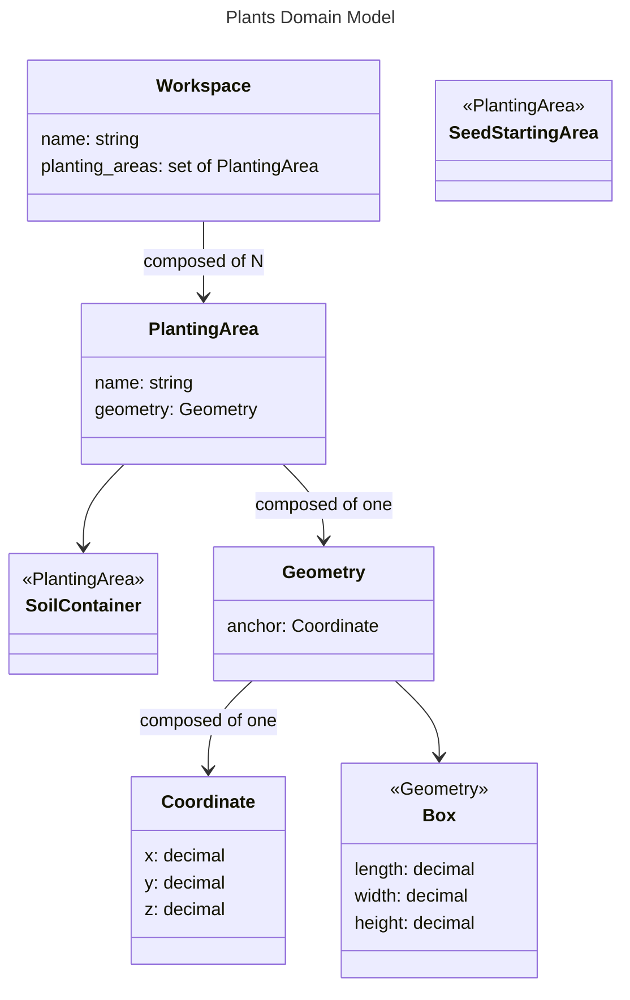

# Garden - Models

```mermaid
---
title: Plants Domain Model
---
classDiagram

    Workspace --> PlantingArea : composed of N
    PlantingArea --> SoilContainer
    PlantingArea --> Geometry : composed of one
    Geometry --> Coordinate: composed of one
    Geometry --> Box

    class Workspace{
        name: string
        planting_areas: set of PlantingArea
    }
    class PlantingArea{
        name: string
        geometry: Geometry
    }
    class SoilContainer{
        <<PlantingArea>>
    }
    class SeedStartingArea{
        <<PlantingArea>>
    }
    class Geometry{
        anchor: Coordinate
    }
    class Coordinate{
        x: decimal
        y: decimal
        z: decimal
    }
    class Box{
        <<Geometry>>
        length: decimal
        width: decimal
        height: decimal
    }

```
